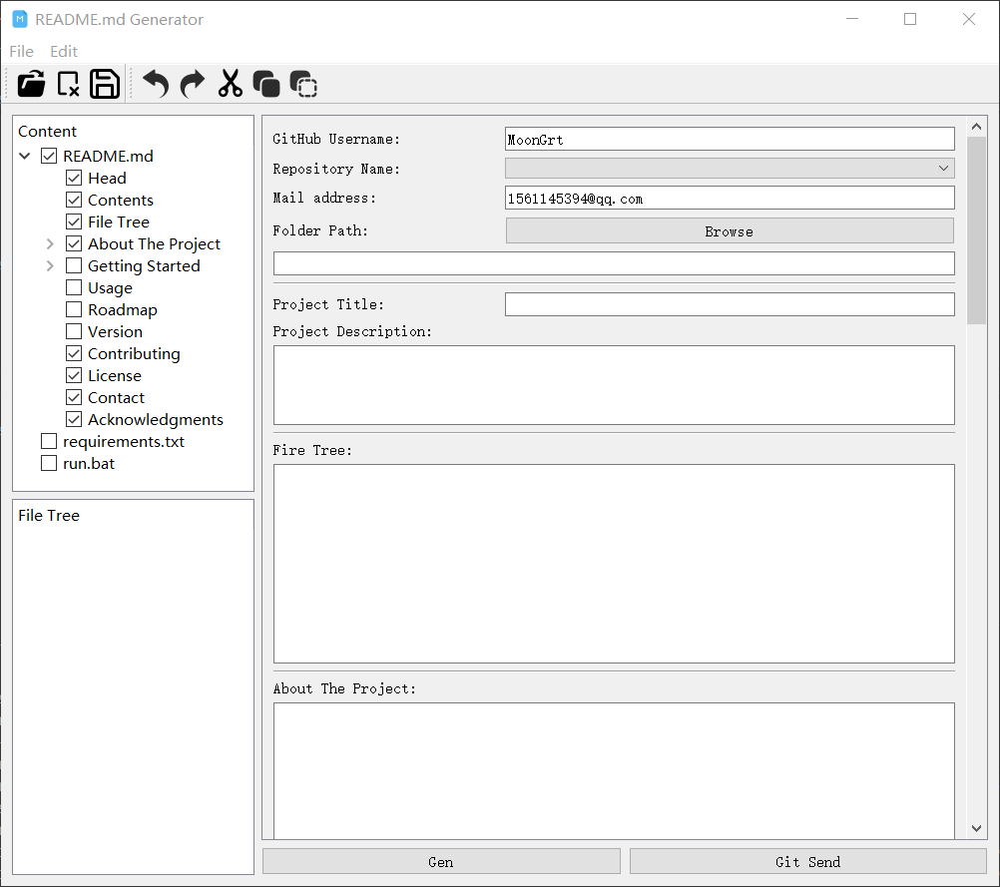

**English | [简体中文](README_cn.md)**<br>
<div id="top"></div>

[![Contributors][contributors-shield]][contributors-url]
[![Forks][forks-shield]][forks-url]
[![Stargazers][stars-shield]][stars-url]
[![Issues][issues-shield]][issues-url]
[![License][license-shield]][license-url]


<!-- PROJECT LOGO -->
<br />
<div align="center">
    <a href="https://github.com/MoonGrt/README_Gen">
    
    </a>
<h3 align="center">README_Gen</h3>
    <p align="center">
    Discover README_generator, the ultimate solution for crafting polished GitHub README.md files effortlessly. Tailor your project documentation with ease, including customizable details, badges, and layouts. Accelerate your workflow with one-click generation and direct GitHub integration. Boost your GitHub presence by effortlessly creating professional project pages.
    <br />
    <a href="https://github.com/MoonGrt/README_Gen"><strong>Explore the docs »</strong></a>
    <br />
    <br />
    <a href="https://github.com/MoonGrt/README_Gen">View Demo</a>
    ·
    <a href="https://github.com/MoonGrt/README_Gen/issues">Report Bug</a>
    ·
    <a href="https://github.com/MoonGrt/README_Gen/issues">Request Feature</a>
    </p>
</div>


<!-- CONTENTS -->
<details open>
  <summary>Contents</summary>
  <ol>
    <li><a href="#file-tree">File Tree</a></li>
    <li>
      <a href="#about-the-project">About The Project</a>
      <ul>
      </ul>
    </li>
    <li><a href="#contributing">Contributing</a></li>
    <li><a href="#license">License</a></li>
    <li><a href="#contact">Contact</a></li>
    <li><a href="#acknowledgments">Acknowledgments</a></li>
  </ol>
</details>


<!-- FILE TREE -->
## File Tree

```
└─ Project
  ├─ ContentTree.py
  ├─ FileTree.py
  ├─ Git.py
  ├─ LICENSE
  ├─ Markdown.py
  ├─ PicText.py
  ├─ README.md
  ├─ README_cn.md
  ├─ README_Gen.py
  ├─ README_Gen_cn.py
  ├─ README_temple.py
  ├─ requirements.txt
  ├─ run.bat
  └─ /images/
    └─ logo.png

```


<!-- ABOUT THE PROJECT -->
## About The Project

<p style=" margin-top:0px; margin-bottom:0px; margin-left:0px; margin-right:0px; -qt-block-indent:0; text-indent:0px;">Discover README_generator, the ultimate solution for crafting polished GitHub README.md files effortlessly. Tailor your project documentation with ease, including customizable details, badges, and layouts. Accelerate your workflow with one-click generation and direct GitHub integration. Boost your GitHub presence by effortlessly creating professional project pages.</p>
<p align="center" style=" margin-top:0px; margin-bottom:0px; margin-left:0px; margin-right:0px; -qt-block-indent:0; text-indent:0px;"></p>
<p style="-qt-paragraph-type:empty; margin-top:0px; margin-bottom:0px; margin-left:0px; margin-right:0px; -qt-block-indent:0; text-indent:0px;"><br /></p></body></html>
<p align="right">(<a href="#top">top</a>)</p>


<!-- CONTRIBUTING -->
## Contributing

Contributions are what make the open source community such an amazing place to learn, inspire, and create. Any contributions you make are **greatly appreciated**.
If you have a suggestion that would make this better, please fork the repo and create a pull request. You can also simply open an issue with the tag "enhancement".
Don't forget to give the project a star! Thanks again!
1. Fork the Project
2. Create your Feature Branch (`git checkout -b feature/AmazingFeature`)
3. Commit your Changes (`git commit -m 'Add some AmazingFeature'`)
4. Push to the Branch (`git push origin feature/AmazingFeature`)
5. Open a Pull Request
<p align="right">(<a href="#top">top</a>)</p>


<!-- LICENSE -->
## License

Distributed under the MIT License. See `LICENSE` for more information.
<p align="right">(<a href="#top">top</a>)</p>


<!-- CONTACT -->
## Contact

MoonGrt - 1561145394@qq.com
Project Link: [MoonGrt](https://github.com/MoonGrt/)
<p align="right">(<a href="#top">top</a>)</p>


<!-- ACKNOWLEDGMENTS -->
## Acknowledgments

* [Choose an Open Source License](https://choosealicense.com)
* [GitHub Emoji Cheat Sheet](https://www.webpagefx.com/tools/emoji-cheat-sheet)
* [Malven's Flexbox Cheatsheet](https://flexbox.malven.co/)
* [Malven's Grid Cheatsheet](https://grid.malven.co/)
* [Img Shields](https://shields.io)
* [GitHub Pages](https://pages.github.com)
* [Font Awesome](https://fontawesome.com)
* [React Icons](https://react-icons.github.io/react-icons/search)
<p align="right">(<a href="#top">top</a>)</p>


<!-- MARKDOWN LINKS & IMAGES -->
<!-- https://www.markdownguide.org/basic-syntax/#reference-style-links -->
[contributors-shield]: https://img.shields.io/github/contributors/MoonGrt/README_Gen.svg?style=for-the-badge
[contributors-url]: https://github.com/MoonGrt/README_Gen/graphs/contributors
[forks-shield]: https://img.shields.io/github/forks/MoonGrt/README_Gen.svg?style=for-the-badge
[forks-url]: https://github.com/MoonGrt/README_Gen/network/members
[stars-shield]: https://img.shields.io/github/stars/MoonGrt/README_Gen.svg?style=for-the-badge
[stars-url]: https://github.com/MoonGrt/README_Gen/stargazers
[issues-shield]: https://img.shields.io/github/issues/MoonGrt/README_Gen.svg?style=for-the-badge
[issues-url]: https://github.com/MoonGrt/README_Gen/issues
[license-shield]: https://img.shields.io/github/license/MoonGrt/README_Gen.svg?style=for-the-badge
[license-url]: https://github.com/MoonGrt/README_Gen/blob/master/LICENSE

