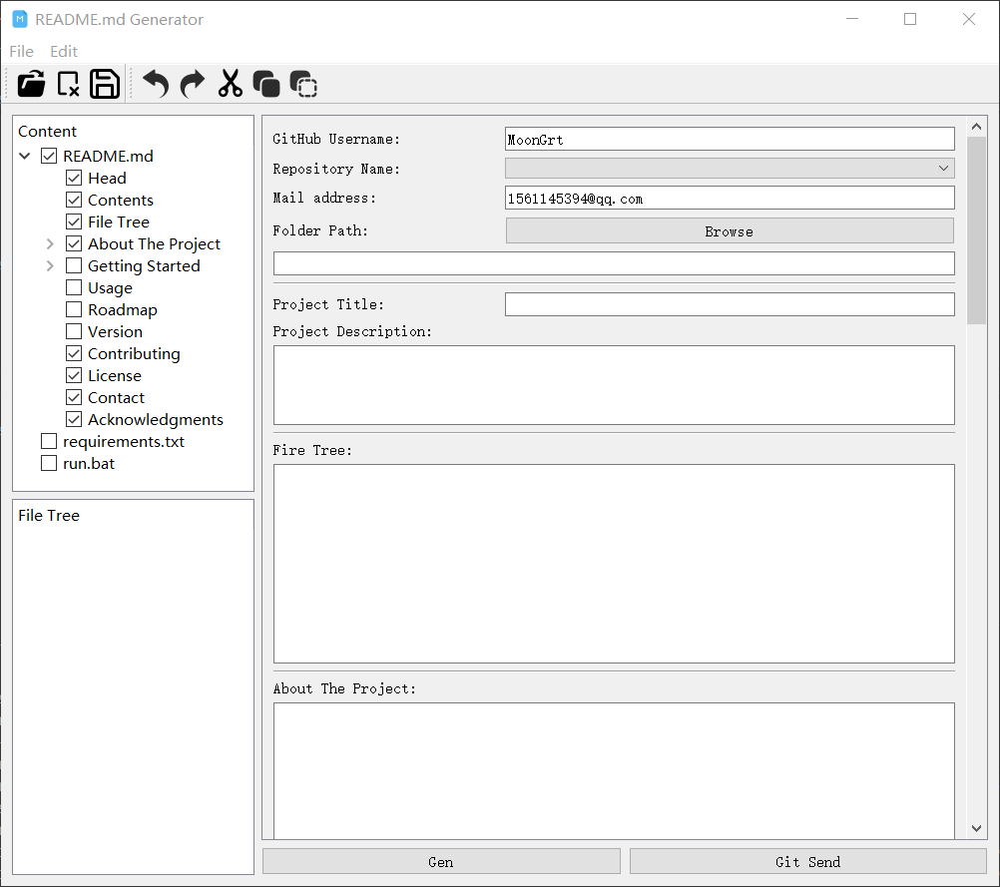
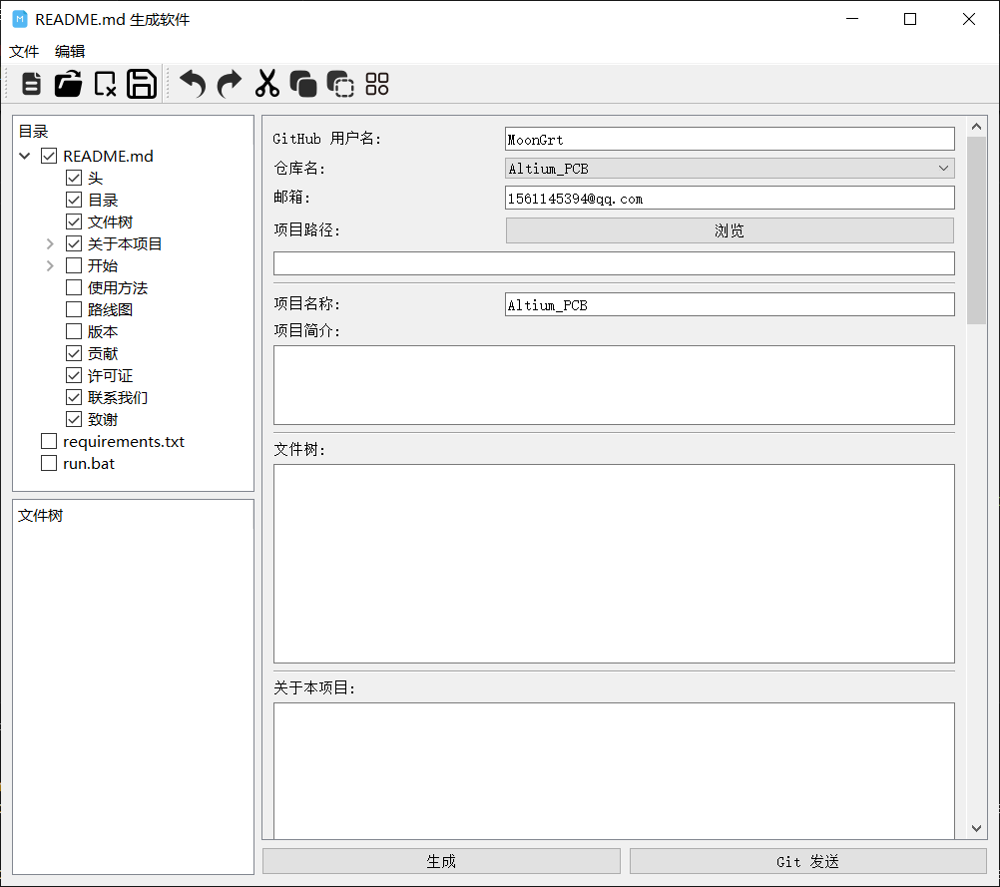
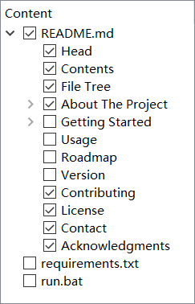
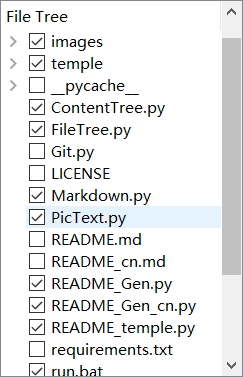
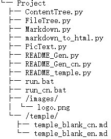
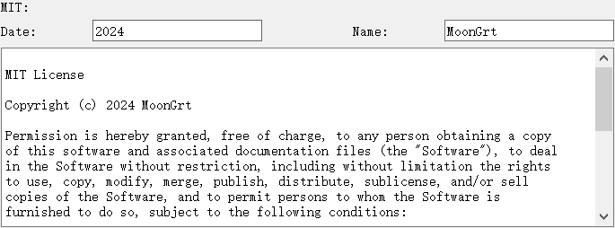

**简体中文 | [English](README.md)**
<div id="top"></div>

[![Contributors][contributors-shield]][contributors-url]
[![Forks][forks-shield]][forks-url]
[![Stargazers][stars-shield]][stars-url]
[![Issues][issues-shield]][issues-url]
[![License][license-shield]][license-url]


<!-- PROJECT LOGO -->
<br />
<div align="center">
    <a href="https://github.com/MoonGrt/README_Gen">
    
    </a>
<h3 align="center">README_Gen</h3>
    <p align="center">
    README_Gen 是轻松制作精美 GitHub README.md 文件的终极解决方案。轻松定制项目文档，包括可定制的细节、徽章和布局。
    <br />
    <a href="https://github.com/MoonGrt/README_Gen"><strong>浏览文档 »</strong></a>
    <br />
    <a href="https://github.com/MoonGrt/README_Gen">查看 Demo</a>
    ·
    <a href="https://github.com/MoonGrt/README_Gen/issues">反馈 Bug</a>
    ·
    <a href="https://github.com/MoonGrt/README_Gen/issues">请求新功能</a>
    </p>
</div>


<!-- CONTENTS -->
<details open>
  <summary>目录</summary>
  <ol>
    <li><a href="#文件树">文件树</a></li>
    <li>
      <a href="#关于本项目">关于本项目</a>
      <ul>
      </ul>
    </li>
    <li><a href="#贡献">贡献</a></li>
    <li><a href="#许可证">许可证</a></li>
    <li><a href="#联系我们">联系我们</a></li>
    <li><a href="#致谢">致谢</a></li>
  </ol>
</details>


<!-- 文件树 -->
## 文件树

```
└─ Project
  ├─ ContentTree.py
  ├─ FileTree.py
  ├─ Markdown.py
  ├─ markdown_to_html.py
  ├─ PicText.py
  ├─ README_Gen.py
  ├─ README_Gen_cn.py
  ├─ README_temple.py
  ├─ run.bat
  ├─ run_cn.bat
  ├─ /Document/images/
  │ └─ logo.png
  └─ /temple/
    ├─ temple_blank_cn.md
    └─ temple_blank_en.md
```


<!-- 关于本项目 -->
## 关于本项目

<p style=" margin-top:0px; margin-bottom:0px; margin-left:0px; margin-right:0px; -qt-block-indent:0; text-indent:0px;">README_Gen 是一个基于 PyQt 开发的 GUI 工具，旨在帮助用户轻松快速地生成 GitHub 项目的 README 文档。用户可以根据精心设计的模板，自由选择要包含的内容，包括 “目录”、“文件树”、“关于本项目”、“使用方法”、“版本”、“贡献”、“许可证”、“联系我们”、“致谢”等。</p>
<p align="center" style=" margin-top:0px; margin-bottom:0px; margin-left:0px; margin-right:0px; -qt-block-indent:0; text-indent:0px;"></p>
<p style=" margin-top:0px; margin-bottom:0px; margin-left:0px; margin-right:0px; -qt-block-indent:0; text-indent:0px;">用户可以在“目录”板块选择想要在项目README包括的内容。软件会根据用户的选择实时更新右侧编辑界面。</p>
<p align="center" style=" margin-top:0px; margin-bottom:0px; margin-left:0px; margin-right:0px; -qt-block-indent:0; text-indent:0px;"></p>
<p style=" margin-top:0px; margin-bottom:0px; margin-left:0px; margin-right:0px; -qt-block-indent:0; text-indent:0px;">当用户输入了项目路径后，软件将扫描该项目并在“文件树”板块显示用户项目文件树（文件、层级等）。用户可以在“文件树”板块选择项目的核心文件，软件将自动将用户的选择添加到README对应的文件树展示模块。</p>
<p align="center" style=" margin-top:0px; margin-bottom:0px; margin-left:0px; margin-right:0px; -qt-block-indent:0; text-indent:0px;"> </p>
<p style=" margin-top:0px; margin-bottom:0px; margin-left:0px; margin-right:0px; -qt-block-indent:0; text-indent:0px;">此外，该软件还集成了生成（MIT）LICENSE、发送Github、README简单预览等功能，如果是python工程，软件还能为用户生成‘requirements.txt’、‘run.bat’。</p>
<p align="center" style=" margin-top:0px; margin-bottom:0px; margin-left:0px; margin-right:0px; -qt-block-indent:0; text-indent:0px;"></p>
<p style="-qt-paragraph-type:empty; margin-top:0px; margin-bottom:0px; margin-left:0px; margin-right:0px; -qt-block-indent:0; text-indent:0px;"><br /></p></body></html>
<p align="right">(<a href="#top">top</a>)</p>


<!-- 贡献 -->
## 贡献

贡献让开源社区成为了一个非常适合学习、互相激励和创新的地方。你所做出的任何贡献都是**受人尊敬**的。

如果你有好的建议，请复刻（fork）本仓库并且创建一个拉取请求（pull request）。你也可以简单地创建一个议题（issue），并且添加标签「enhancement」。不要忘记给项目点一个 star！再次感谢！

1. 复刻（Fork）本项目
2. 创建你的 Feature 分支 (`git checkout -b feature/AmazingFeature`)
3. 提交你的变更 (`git commit -m 'Add some AmazingFeature'`)
4. 推送到该分支 (`git push origin feature/AmazingFeature`)
5. 创建一个拉取请求（Pull Request）
<p align="right">(<a href="#top">top</a>)</p>


<!-- 许可证 -->
## 许可证

根据 MIT 许可证分发。打开 [LICENSE.txt](LICENSE.txt) 查看更多内容。
<p align="right">(<a href="#top">top</a>)</p>


<!-- 联系我们 -->
## 联系我们

MoonGrt - 1561145394@qq.com
Project Link: [MoonGrt/README_Gen](https://github.com/MoonGrt/README_Gen)
<p align="right">(<a href="#top">top</a>)</p>


<!-- 致谢 -->
## 致谢

在这里列出你觉得有用的资源，并以此致谢。我已经添加了一些我喜欢的资源，以便你可以快速开始！

* [Choose an Open Source License](https://choosealicense.com)
* [GitHub Emoji Cheat Sheet](https://www.webpagefx.com/tools/emoji-cheat-sheet)
* [Malven's Flexbox Cheatsheet](https://flexbox.malven.co/)
* [Malven's Grid Cheatsheet](https://grid.malven.co/)
* [Img Shields](https://shields.io)
* [GitHub Pages](https://pages.github.com)
* [Font Awesome](https://fontawesome.com)
* [React Icons](https://react-icons.github.io/react-icons/search)
<p align="right">(<a href="#top">top</a>)</p>


<!-- MARKDOWN LINKS & IMAGES -->
<!-- https://www.markdownguide.org/basic-syntax/#reference-style-links -->
[contributors-shield]: https://img.shields.io/github/contributors/MoonGrt/README_Gen.svg?style=for-the-badge
[contributors-url]: https://github.com/MoonGrt/README_Gen/graphs/contributors
[forks-shield]: https://img.shields.io/github/forks/MoonGrt/README_Gen.svg?style=for-the-badge
[forks-url]: https://github.com/MoonGrt/README_Gen/network/members
[stars-shield]: https://img.shields.io/github/stars/MoonGrt/README_Gen.svg?style=for-the-badge
[stars-url]: https://github.com/MoonGrt/README_Gen/stargazers
[issues-shield]: https://img.shields.io/github/issues/MoonGrt/README_Gen.svg?style=for-the-badge
[issues-url]: https://github.com/MoonGrt/README_Gen/issues
[license-shield]: https://img.shields.io/github/license/MoonGrt/README_Gen.svg?style=for-the-badge
[license-url]: https://github.com/MoonGrt/README_Gen/blob/master/LICENSE

